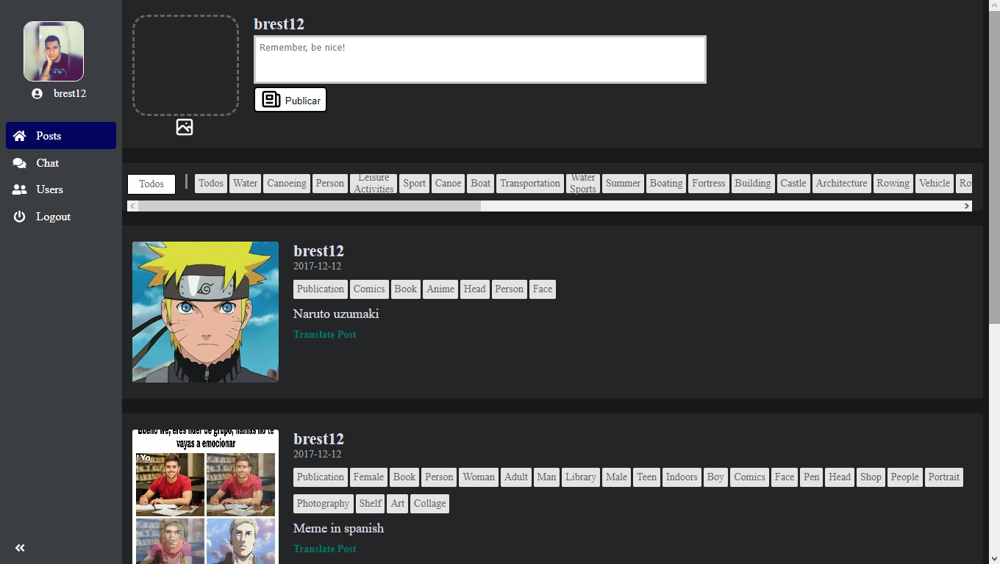
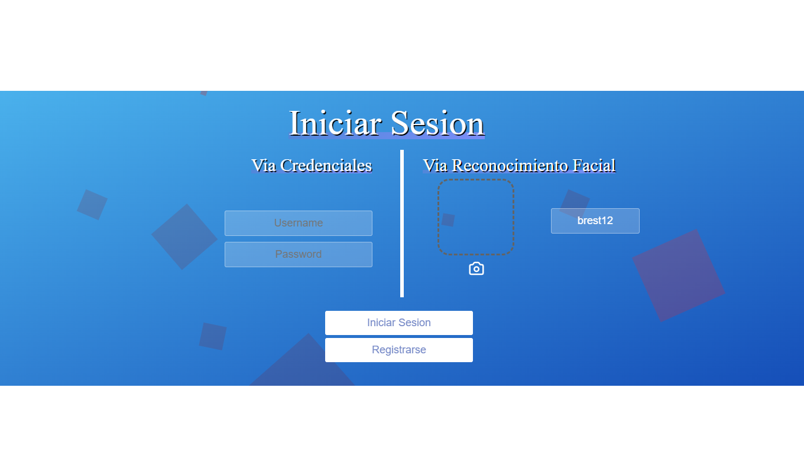
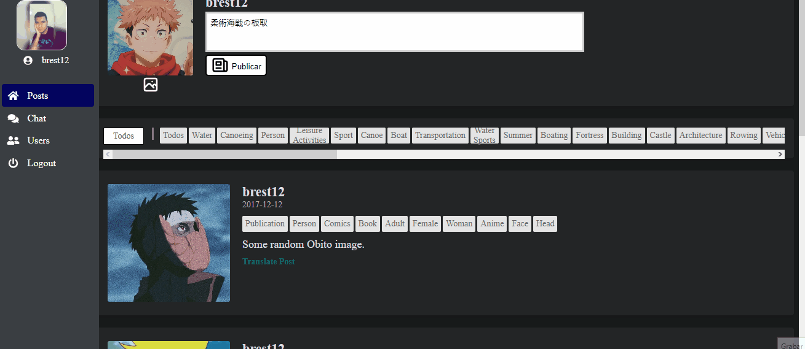
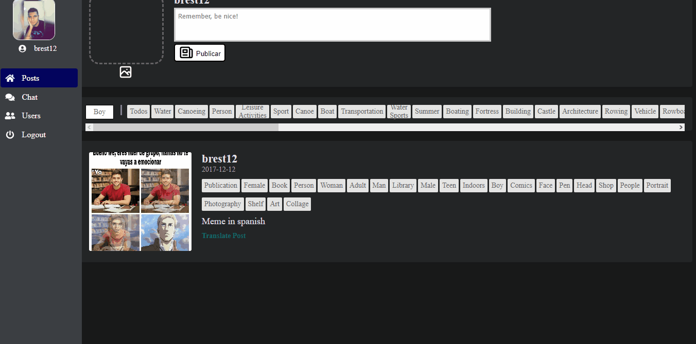
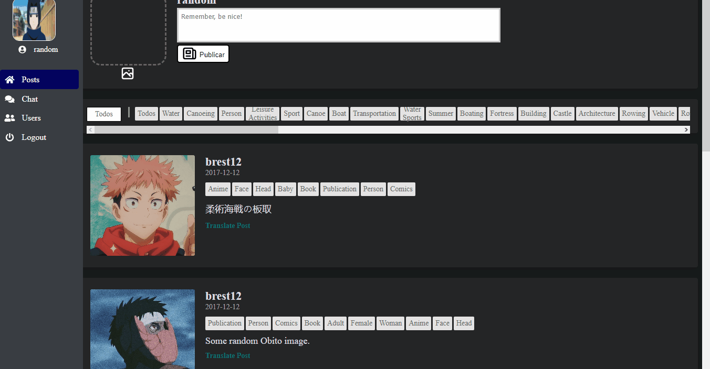

# U-Social 

| Nombre                             | Email|
|------------------------------------|-----------|
| Juan Antonio Pineda Espino              | jpinedaespino@gmail.com |

<hr>

## About the Project

<p align="center"> 
  
</p>

This project was made with the goal of creating a full stack app that is connected to some cloud services and deployed in AWS (You can check the architecture [Here](Services%20Description%20README.md)).

This webapp allows you to create users, add friends, create new posts with images, translate them from any language to spanish, filter them by tag and more!
(This version does NOT have chat :c)

### Built With
* Frontend: [Vue.js](https://vuejs.org)
* Backend: 
  * [Typescript](https://jquery.com)
  * [NodeJS](https://nodejs.org)
  * [Express](https://expressjs.com)
* Database: [MySQL](https://www.mysql.com)
* Docker: [Docker](https://www.docker.com)
* AWS: [AWS](https://aws.amazon.com/es/)


> :warning: **Important**: Remember this was done for learning purposes. This App was developed in 1-2 weeks, so there's probably some not good looking Vue, JS & HTML/CSS practices. :warning:

<!-- GETTING STARTED -->
## Getting Started

### Prerequisites

* [Docker](https://docs.docker.com/engine/install/ubuntu/)
* [Docker compose](https://docs.docker.com/compose/)
* MySQL 
* AWS account
  * Cognito user pool
  * S3 Storage Bucket
  * User with **S3** full access permissions
  * User with **Rekognition** full access permissions
  * User **Amazon Translate** full access permissions

### Installation

1 Clone the repo
   ```sh
   git clone https://github.com/JPineda12/FullStack-SocialApp.git
   ```
2 Create the Database
  - On your own MySQL instance run the .sql script from this repo (in Database folder) called [Database_Creation.sql](Database/1.%20Database_Creation.sql). This script contains the table definitions that the app requires, you can also check the model [here](Database/0.%20Modelo.png). You also have to run the second script which contains some initial data and stored procedures. [Procedures_n_initialdata.sql](Database/2.%20Procedures_n_initialdata.sql)

3 Now that you have the database created, you now need to configure the .env files for the backend and frontend to work. There's an .env example file for both (in backend folder and u-social folder).
<br>

In the backend you just need to put your MySQL and cloud credentials for each service. 
In the Frontend (u-social folder) you just put the backend url, If you are gonna run it locally leave it as http://localhost:3010/api (3010 is the port you put in the backend's .env file)


### Usage
1. Go to the root folder, where the docker-compose.yml file is and in a terminal run:
   ```sh
   docker compose up -d 
   ```
   
### The App 

The frontend runs on http default port 80. 

```
http://localhost
```
#### Login



#### Post Translation


#### Post Filtering


#### Adding a Friend

